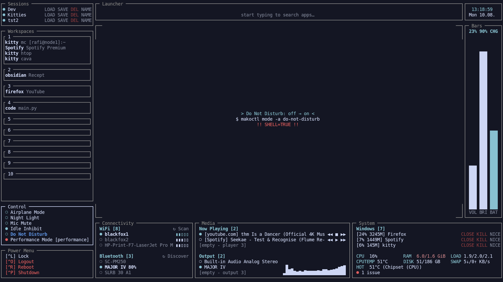
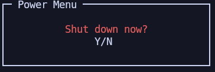
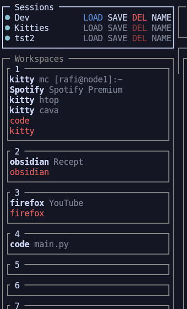
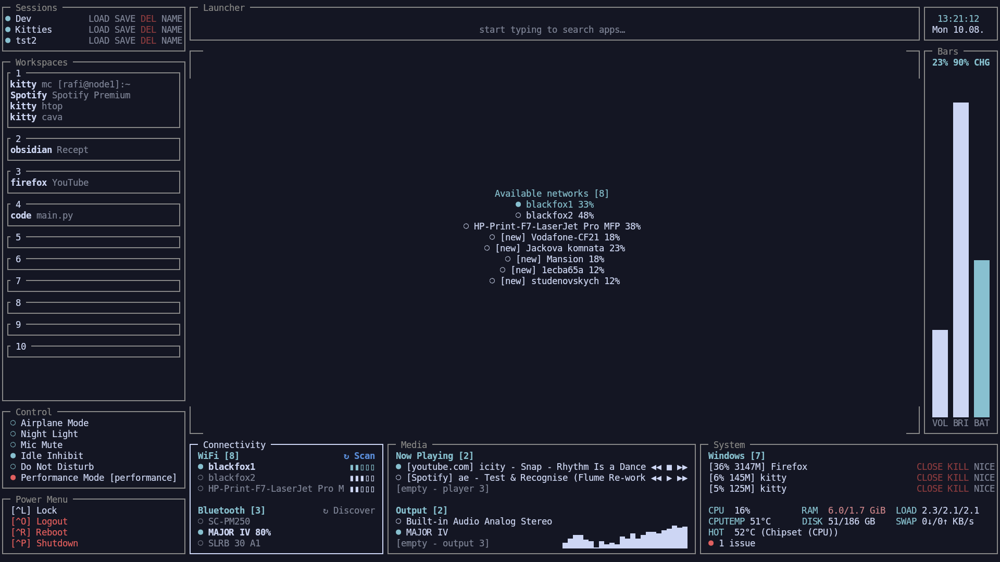
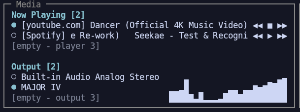
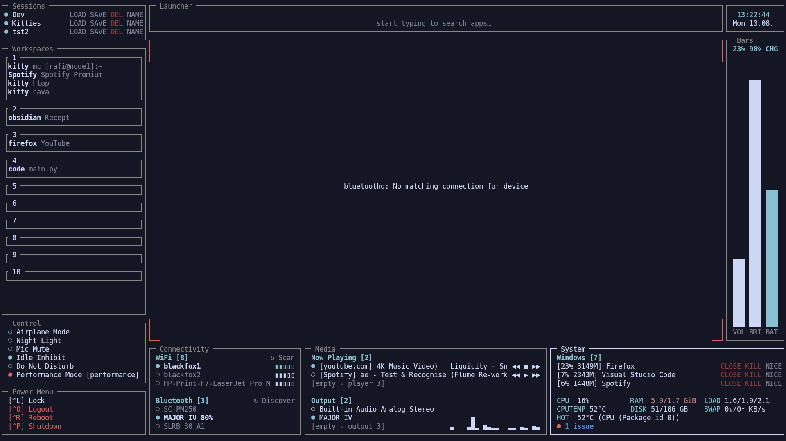
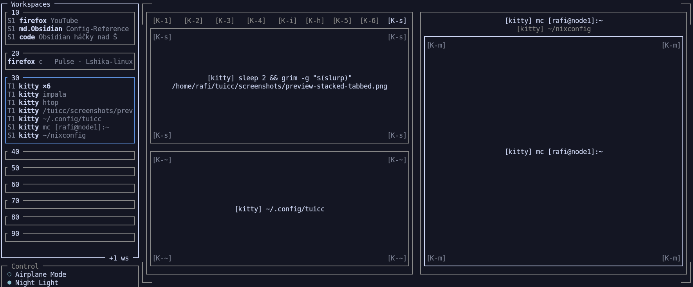

# TUI Command Center
## Status: early / experimental

one keybind - one place - one central point to control the system.

Controlled with Tab/Shift+Tab, arrows and Enter

Every box you see can be moved, resized, deleted. Most are configurable somehow in .config


Summon TUICC with a key-combo, and get modules that help you see and control the system/wm —

- your workspaces and what's in them (sidebar.py);
- a live overview of what's on screen (preview.py);
- an integrated app launcher (launcher.py);
- which wifi/BT devices are connected, and connecting to new ones (connectivity.py);
- a way to save and restore open windows across workspaces (sessions.py);
- system toggles — night light, power profiles, DND, whatever on/off-style
  shell commands your setup uses (control.py);
- now-playing + transport controls for whatever's running over MPRIS, output
  switching, and an optional live audio visualizer (media.py);
- vertical VOL/BRI/BAT gauges (bars.py);
- per-window CPU/RAM, overall system stats, and a diagnostics summary
  (sysmon.py);
- a power menu (power_menu.py);
- a clock, plus a compact weather readout when `[weather]` is configured (rwb.py, weather.py).

## A closer look

### CONTROL
**Control shows you the exact command before it runs.** Hover any toggle and the preview shows what will actually execute — including whether it goes through a real shell (`shell_true`), not just the friendly label.



### POWERMENU
**Destructive actions ask first.** Anything with `confirm = true` — shutdown, reboot, logout, or your own quick actions — shows a plain Y/N prompt before it runs anything.



### SESSIONS
**Loading a session tells you exactly what's about to change.** Windows that would spawn show up in red under the workspace they're headed for, right alongside what's already there — so you know before you commit whether a workspace's existing windows are about to get replaced.



### CONNECTIVITY
**Hover the WiFi header for the full scan list.** The list itself only shows a few rows at a time, but hovering "WiFi" shows every network tuicc currently sees.



### MEDIA
**Media's lists scroll too.** Now Playing and Output both use the same fixed-slot-plus-scroll list every scrollable module here shares — 3 visible rows by default, independently configurable per module via `visible_slots` in `config.toml`.



### SYSTEM MONITOR
**System gives you a live per-window resource readout, plus what's actually wrong on the machine.** CPU/RAM per open window (with CLOSE/KILL/NICE actions), a compact CPU/RAM/DISK/LOAD/temperature/swap stats grid, and a one-line diagnostics summary — failed systemd units, OOM kills, and deduped journal errors — that expands on hover into the real detail behind each issue.
I like this because I appreciate when my PC tells me what broke :D



### PREVIEW
**Stacked and tabbed containers show every member** Each one gets its own row (stacked) or tab (tabbed) — the active member gets a real box, the rest get a thin bar. If that active slot is itself a split (a terminal opened next to an editor mid-stack, say), the whole thing renders exactly as tiled, nested right inside the group.



(That active tab's own title is literally the screenshot command mid-run — the preview doing its work... :D)

Not yet built:

- scrollable-WM support (`scroll`/niri, see "Writing your own WM provider" below, most likely not in V0.1.0 tho :c unless someone would want to help);
- a `quick_actions` module exists in the code but isn't wired into the default layout yet (reserved for something more open-ended later).
- ←→-adjust interaction for the bars module's gauges (display-only for now, see above)
- Calendar, perhaps? considering if this is in scope/useful
- These will be added eventually, but right now, the priority is a stable V0.1.0

Missing something? 
- See wiki, write a module!

Don´t like some of the modules above? 
- Shit man, I'm not here to dictate your modules, make them go away or move them around in the resize tool.

Don´t like that it´s fullscreen? 
- That's ok too! You absolutely can run it not-fullscreen.. I recommend leaving it floating tho, otherwise preview.py has a bad bad time. (We need to hide tuicc from the preview, and if tuicc is tiled, there's an obvious blank spot in the workspace)


This is an early project of mine — what I'm excited about is that it's theoretically possible to run on any tiling WM, as long as you're able to write your own WM provider: **the only part of the code that talks directly to your WM** and translates it into tuicc's data.

## Try it 

```bash
git clone https://github.com/Lshika-linux/tuicc
cd tuicc
python -m venv .venv
source .venv/bin/activate
pip install -r requirements.txt
python main.py
```
- this way it's a clean install and you will need to visit the config in ~/.config to set it up.
Wiki is helpful here, see [Config Reference](https://github.com/Lshika-linux/tuicc/wiki/Config-Reference)).
- if thats too much trouble for a random repo, I understand xd, quick install is for you


## Quick install 

Scared to / don't want to touch configs? This is for you -  (scratchpad summon, keybind, the
works.. set up by the installer) instead of reaching into your config manually. 

```bash
curl -fsSL https://raw.githubusercontent.com/Lshika-linux/tuicc/main/install.sh | bash
```

What install.sh does:

Clones tuicc into `~/.local/share/tuicc`, sets up a venv, detects sway
vs i3 (asks if it can't tell), detects which wifi backend is actually
running — iwd or NetworkManager (asks if it can't tell; soft, unlike
the WM detection — the packaged default works either way, this just
saves you an edit), asks which terminal to run tuicc in and
what keybind to summon it with (defaults: whichever terminal it's
running in, `$mod+Tab`), asks whether to show tuicc fullscreen or as a
plain floating window (default: fullscreen — the full experience out
of the box, no i3/sway config expertise needed first; plain floating
is better left as a tweak you opt into later, not the starting point),
then seeds `~/.config/tuicc/config.toml` with `provider`/`self_app_id`/
`fullscreen_only`/`wifi_backend` all set to match (see "Summoning tuicc" below) and
installs a filled-in toggle script to `~/.local/bin/tuicc_toggle.py`.
It offers (asks first — never does this silently) to append the WM
config block and reload sway/i3 for you; say no and it just prints the
block to paste in and reload yourself. Re-run it any time to update
(`git pull`s the existing checkout instead of re-cloning, and never
overwrites an existing `config.toml`).

Prefer to see exactly what it does first, or don't want to pipe a
script straight into bash? Your safety concerns are valid! 

    `curl -fsSL <url above> -o install.sh`

read it, then 
    
    `bash install.sh`

Quick navigation cheat sheet: Tab/Shift+Tab (or arrows) move between
items, rolling into the next/previous module at either end; Left/Right
switches between modules. + Enter to select something. Start writing at
any point to summon the launcher. You can use arrows to change where 
launcher will move the launched window after it spawns it.

Full details, every key, and how it all actually decides
where to go: [Keybindings](https://github.com/Lshika-linux/tuicc/wiki/Keybindings)
on the wiki.

tuicc is meant to run as one long-lived process your WM shows and
hides — see "Summoning tuicc" below — with `Ctrl+C` as the only way to
actually end it (no quit menu, no quit keybind). Requires a running
sway or i3 session; set `provider = "sway"` or `provider = "i3"` under
`[wm]` in your config. On i3, also check the power menu's Lock/Logout
commands — the packaged defaults are `swaylock`/`swaymsg exit`, which
`install.sh` swaps for `i3lock`/`i3-msg exit` automatically; a plain
git-clone setup needs that edited by hand.

(if you're unsure, click the "issues" here on github and ask me anything. See the wiki! If you're not about to read a full wiki, again, ask me anything in the issues.) 

## Configuration

tuicc reads from `~/.config/tuicc/config.toml`, created automatically
(copied from a packaged default) the first time you run it — so
there's always a real, editable file, never a hidden in-code default.
Layout presets work the same way, per preset number:
`~/.config/tuicc/presets/<N>.toml`, seeded from a built-in template
the first time that number is requested. A preset is a list of boxes,
each an x/y ratio (0.0-1.0) of the terminal's width/height plus,
per axis, either a w/h ratio or a fixed fw/fh cell count (for content
that needs an exact row/column count, not a proportion — e.g.
control's toggle list). A box's own configured numbers never depend on
another box's, so what you configure is what you get, aside from a few
narrow render-time adjustments (a fixed box holds its own edge instead
of getting clipped; a ratio box yields just enough to avoid overlapping
one). If a box looks wrong on a different terminal size, fix it with
tuicc's own interactive resize mode (`F2` on the module) rather than
hand-computing ratios.

Colors work the same live-editable way: `F1` → `3` opens the Colors
page, `Enter` on a role edits it in place (named color / `#hex` /
`inherit`), and `F4`/`F5` cycle through 10 built-in named schemes
(Dracula, Nord, Solarized Dark, Gruvbox, One Dark, Rose Pine,
Catppuccin Mocha, Tokyo Night, LEGACY, plus tuicc's own Default) and
save your own tweaks as a new preset — `F7` cycles the same list from
anywhere, not just that page.

Every section — layout, navigation, theme, power menu, quick actions,
and the rest — is documented field-by-field in the wiki's
[Config Reference](https://github.com/Lshika-linux/tuicc/wiki/Config-Reference),
including the reasoning behind choices like why `power_menu` and
`quick_actions` take identical fields but stay in separate namespaces.

### Required system daemons

The connectivity module (in the default layout) needs these actually
running, not just installed — every current sway/i3 desktop has them
already, so this is rarely something you need to think about:

- **iwd or NetworkManager** (`[network] wifi_backend`, default `iwd`)
  — whichever one is your system's real wifi daemon; `install.sh`
  detects which is running and sets this for you (see "Quick install"
  above).
- **bluez** (`bluetoothd`) — bluetooth's own standard daemon on Linux;
  no alternative backend exists for this one.

Neither missing/not-running crashes tuicc — the connectivity module
shows a real error for that backend instead (e.g. `wifi_error`) and
everything else keeps working.

### Optional external tools

None of these are Python dependencies (`requirements.txt` doesn't
change) — they're system binaries a couple of modules shell out to,
same category as `swaylock`/`i3lock` in the power menu, except these
are picked by tuicc's own code rather than something you type into
`config.toml` yourself:

- **`wpctl` or `pactl`** (`[audio] audio_backend`, default `wpctl`) —
  needed for output-device switching in the media module, and for the
  bars module's VOL gauge. `wpctl` (WirePlumber's CLI) is the right
  pick on basically every current sway/i3 setup; `pactl` is there for
  plain PulseAudio instead.
- **`brightnessctl`** — backs the bars module's BRI gauge.
- **`cava`** — genuinely optional, not required for anything else in
  the media module to work. Missing it just means no visualizer bars
  next to the output list — no warning, no degraded feature, tuicc
  doesn't even try to spawn it unless something's actually playing.
- **`lm-sensors`** (the `sensors` binary) — backs the system module's
  CPUTEMP/HOT readings. Same tolerance as `cava`: missing it just means
  those two values show as unknown (`?°C`), no warning, no crash.

Any of these missing degrades gracefully (a real, readable error where
it's actually relevant — see `[[control.toggle]]` in
[Config Reference](https://github.com/Lshika-linux/tuicc/wiki/Config-Reference)
for the same idea applied to your own toggle commands), never a crash.

## Summoning tuicc

tuicc is meant to run as a single, long-lived process, toggled into and
out of view by your WM — not relaunched each time. Launch it once (by
hand, or from your WM's startup config), then bind a key that shows/
hides its window; dismissing (Enter on most actions, or Escape at the
top level) hides it instantly with a warm process and warm caches,
ready for the next summon. The only way to actually end the process is
`Ctrl+C`. `install.sh` (see "Quick install" above) sets this up for
you automatically; here's the shape of it for sway, by hand:

```
# ~/.config/sway/config
for_window [app_id="tuicc_scratch"] floating enable
for_window [app_id="tuicc_scratch"] move position 0 0
for_window [app_id="tuicc_scratch"] resize set 100 ppt 100 ppt
for_window [app_id="tuicc_scratch"] fullscreen enable
bindsym $mod+Tab exec ~/scripts_sway/tuicc_toggle.py
```

**`[wm] self_app_id` in `config.toml` must match the `app_id`/`class`
above exactly** (`"tuicc_scratch"` here) — this isn't cosmetic. Without
it, tuicc falls back to marking "whatever window currently has focus"
as itself, so it can filter its own window out of its sidebar/window
list; if some other window still happens to hold focus for a moment
when tuicc starts (a real, reproduced case: a slow-to-yield-focus app
like VS Code, launched via a keybind), tuicc marks THAT window as
itself instead, and it silently vanishes from every list tuicc shows
from then on — until you find and remove the stray `_tuicc_self_<pid>`
mark by hand (`swaymsg '[con_mark="_tuicc_self_<pid>"] unmark
"_tuicc_self_<pid>"'`, from `swaymsg -t get_tree`'s output) and set
`self_app_id` to stop it recurring. `install.sh` sets both sides of
this correctly for you; a hand-written launcher (like the one below)
must set it yourself.

[`contrib/sway/tuicc_toggle.py`](contrib/sway/tuicc_toggle.py) (and
its i3 counterpart) is the one-keybind toggle script that block calls
— launches tuicc if it isn't running, dismisses it if focused, brings
it to focus otherwise. Full per-WM reference (i3, Hyprland, niri, the
by-hand summon without the toggle script, and the reasoning behind
each line — including a real swayfx gotcha with chained `for_window`
actions) lives on the wiki:
[Summoning tuicc](https://github.com/Lshika-linux/tuicc/wiki/Summoning-Tuicc).

## Architecture

The core does three things, and only three things: a **WM provider
layer** translates window-manager state into a generic model
(`Window`, `Region`, `WMState`) so nothing else needs to know which WM
you're running; a **layout engine** converts a layout (x/y ratios,
plus a ratio or a fixed row/column count per axis) into absolute
terminal cells for each module; **input routing** handles tab order,
global shortcuts, and hotkeys over a generic `NavItem` list,
independent of which module an item belongs to.

Modules — the sidebar, the preview, the launcher, connectivity, the
power menu, sessions, control (user-defined toggles/cycles), media
(MPRIS now-playing + output switching + cava visualizer), bars
(volume/brightness/battery gauges), the system monitor (per-window
CPU/RAM, overall stats, diagnostics), and future ones — live as
standalone files under `modules/`, each owning both how
it draws itself and where its own focusable items are; adding one
means adding a line to `render.py`'s registries, not touching the
render loop itself. Config and presets are plain, transparent TOML, no
hidden defaults baked into Python — delete one and tuicc regenerates a
fresh default.

The full picture — the RenderContext pattern, why floating windows are
drawn as an overview rather than pixel-perfect, why spatial navigation
was tried and dropped, the dismiss-vs-quit process lifecycle — is on
the wiki: [Architecture](https://github.com/Lshika-linux/tuicc/wiki/Architecture).

## Project structure

```
src/tuicc/
├── model.py                  # Window, Region, WMState — the generic WM model
├── layout.py                 # ModuleBox, Layout — module positions/sizes,
│                              #   as ratios, or a fixed row/column count per axis
├── layout_engine.py          # resolves a Layout into absolute terminal cells
├── navigation.py              # NavItem, tab-order/hotkey navigation
├── windowed_list.py            # fixed N-visible-slots + scrollable-via-peek-nav-items list
│                              #   mechanic shared by media.py (Now Playing/Output) and sysmon.py (windows)
├── title_condense.py            # window-title condensing shared by sidebar.py's detail line and
│                              #   preview.py's own per-window labels — "what's actually running",
│                              #   not just the app's own name repeated back
├── keybinds.py                 # config key names -> curses key codes
├── actions.py                   # region/window focus handlers shared across modules
├── context.py                    # RenderContext — everything a module needs per frame
├── app_setup.py                   # one-time construction of every long-lived dependency
│                                  #   main()'s loop needs (backends, D-Bus agents, StatusWorker)
├── frame_update.py                 # update_frame() — WM state, pid resolution, focus-transition
│                                  #   detection, pending_moves, the RenderContext/nav-list build
├── loop_state.py                    # LoopState — explicit main()-loop-owned state, replacing
│                                  #   the closure-capture + nonlocal main() used to lean on
├── theme.py                       # resolves config colors (named/hex/RGB) to curses color numbers
├── theme_setup.py                  # one-time curses color pair setup at startup
├── theme_presets.py                 # built-in named color schemes + user-saved-preset cycling (F4/F5/F7)
├── config.py                        # loads + merges packaged defaults, presets, user config
├── render.py                         # module registry (draw + nav_items + action handlers)
├── render_utils.py                    # shared curses drawing helpers
├── resize_mode.py                      # interactive resize/move — ResizeState, SpawnPickerState
├── help_mode.py                        # F1 help menu — FAQ/keybinds, resize reference, color editor
├── status_worker.py                     # StatusWorker/Domain — one background poll thread shared by
│                                        #   wifi/bluetooth/audio/media/every control.toggle/sysmon's own domains
├── push_worker.py                        # PushWorker/CombinedStatus — event-driven counterpart to
├── combined_status.py                    #   StatusWorker, built+tested but NOT currently wired into
│                                        #   main.py — see CLAUDE/VISION.md's R8 for the open question this gates
├── control.py                            # backend for [[control.toggle]] — status_command + per-state command
├── brightness.py                          # brightnessctl wrapper (backend only, not wired into a module yet)
├── battery.py                              # /sys/class/power_supply reader — backs bars.py's BAT gauge
├── netinfo.py                               # IPv4 lookup for a network interface — neither wifi backend owns this
├── weather.py                                # Open-Meteo current conditions + short outlook — backs rwb.py
├── procmon.py                               # per-window CPU/RAM: /proc parsing, full-subtree aggregation,
│                                          #   PidFeed (crosses the main-thread/StatusWorker-thread boundary)
├── sysinfo.py                               # overall CPU%/RAM/disk/load/throttle/swap — backs sysmon.py's stats grid
├── sensors.py                               # `sensors -j` wrapper — vendor-aware CPU temp + hottest-sensor reading
├── diagnostics.py                           # failed systemd units + OOM + deduped journal errors — sysmon.py's
│                                          #   diagnostics line
├── session.py                              # capture/save/load a session's window layout (sessions.py's backend)
├── pending_moves.py                         # PendingMovesQueue — matches a spawned/restored window to its
│                                          #   target region once it maps, staggered, with a timeout
├── tab_groups.py                             # stacked/tabbed container detection, shared by providers/sway.py
│                                          #   and providers/i3.py (con.layout/con.focus are WM-agnostic)
├── wm_config_parser.py                        # best-effort workspace identity from the WM's own config text
│                                          #   (bindsym/for_window/assign) — shared by both providers too
├── defaults/config.toml                  # packaged default config
├── presets/                               # built-in layout presets (plain TOML) — copied to
│                                          #   ~/.config/tuicc/presets/<N>.toml on first use
├── modules/
│   ├── sidebar.py                # workspace list, reports nav items
│   ├── sidebar_compact.py        # compact workspace picker, no window listing
│   ├── preview.py                 # windows of the currently focused workspace
│   ├── launcher.py                 # fuzzy app search + launch
│   ├── connectivity.py              # wifi/bluetooth status + toggle
│   ├── control.py                    # [[control.toggle]] rows — status dot + advance-on-confirm
│   ├── media.py                       # MPRIS now-playing + transport + output switching + cava visualizer
│   ├── bars.py                         # VOL/BRI/BAT vertical gauges
│   ├── sysmon.py                       # per-window CPU/RAM list (CLOSE/KILL/NICE) + a configurable
│   │                                  #   ([[sysmon.block]]) overall-stats grid + a diagnostics summary line
│   ├── power_menu.py                   # lock/logout/reboot/shutdown, user-defined
│   ├── sessions.py                      # save/load/delete a named set of window positions
│   ├── quick_actions.py                  # generic action list — not in the default layout yet
│   └── rwb.py                             # "real world box" — time, date, and a compact weather
│                                          #   readout when [weather] is configured (see weather.py)
└── providers/
    ├── base.py                # Provider contract every WM provider implements
    ├── registry.py             # provider name -> Provider class
    ├── sway.py                  # sway implementation
    └── i3.py                     # i3 implementation

src/tuicc/connectivity/
├── base.py                  # WifiBackend/WifiAgent/BluetoothBackend contracts
├── registry.py               # backend/agent name -> class (WIFI_BACKENDS/WIFI_AGENTS/BLUETOOTH_BACKENDS)
├── iwd.py                     # wifi via iwd, over D-Bus (not iwctl text parsing)
├── iwd_agent.py                 # iwd's own D-Bus "Agent" — prompts for a wifi passphrase interactively
├── networkmanager.py             # wifi via NetworkManager — the second selectable wifi backend
├── networkmanager_agent.py         # NetworkManager's own D-Bus secret agent, same role as iwd_agent.py
├── bluez.py                          # bluetooth via D-Bus (org.bluez), not bluetoothctl text parsing
├── bluez_agent.py                      # bluez's own D-Bus pairing agent — confirms a new device's pairing
├── agent_mailbox.py                      # cross-thread handoff between an agent's own dispatch loop and
│                                        #   the render loop (shared by all three *_agent.py files above)
├── model.py                                # WifiNetwork/BluetoothDevice — the generic connectivity model
└── util.py                                   # shared D-Bus call helper + decode_ssid()

src/tuicc/audio/
├── base.py                # AudioBackend contract
├── registry.py             # backend name -> backend class ([audio] audio_backend)
├── wpctl.py                  # WirePlumber CLI (the primary backend — PipeWire is the norm on sway/i3)
├── pactl.py                   # plain PulseAudio fallback
└── model.py                     # AudioSink — the generic sink model

src/tuicc/media/
├── base.py                # MediaBackend contract
├── mpris.py                 # the only real backend — talks to org.mpris.MediaPlayer2.* over D-Bus
├── model.py                   # Player — the generic now-playing model
└── cava.py                     # optional: CavaReader, a background thread streaming `cava`'s raw
                                #   output for modules/media.py's audio visualizer — genuinely
                                #   different shape from every other backend here (continuous
                                #   stream, not a periodic poll), see its own module docstring
```

## Writing your own WM provider

tuicc doesn't know what sway, i3, or anything else is — it only knows
the `Provider` contract in `src/tuicc/providers/base.py`. If your WM
can implement this contract, tuicc can run on it, no changes needed
anywhere else in the codebase. The five required methods:

```python
class Provider(ABC):
    def get_state(self) -> WMState:
        """Return the current window-manager state."""

    def focus_region(self, region_id: str) -> None:
        """Switch the WM's focus to the given region (e.g. workspace)."""

    def focus_window(self, window_id: str) -> None:
        """Switch the WM's focus to the given window."""

    def move_window_to_region(self, window_id: str, region_id: str) -> None:
        """Move the given window to the given region, without changing
        which region is currently visible."""

    def close_window(self, window_id: str) -> None:
        """Close the given window."""
```

(a few more optional methods exist for niceties like dismissing
tuicc's own window cleanly — see the wiki page below for the full
list.) `WMState` (`model.py`) is the generic shape every provider
translates into: `Region`s holding `Window`s, positions normalized to
0..1 so tuicc never needs your screen resolution. Register a new
provider in `src/tuicc/providers/registry.py` and it's selectable via
`provider = "yourwm"` in config — that's the entire integration
surface, nothing in `main.py`/`render.py`/any module needs to change.

`src/tuicc/providers/sway.py` and `src/tuicc/providers/i3.py` are the
reference implementations, short and worth reading end to end. The
full guide — a real walkthrough of building one against a live WM,
what changes between a wlroots WM and an X11 one, and how to handle a
window layout that doesn't map cleanly onto sway's model (scrolling/
infinite layouts like `scroll`/niri) — is on the wiki:
[Writing a WM Provider](https://github.com/Lshika-linux/tuicc/wiki/Writing-a-WM-Provider).
Open an issue or a draft PR if you get stuck; I'd genuinely like to
see this work on more than just sway and i3.


## Testing

Tests are written by Claude, and I can't understand them just yet. That's ass.
I will revisit tests around V0.1.0 to make sure they actually are useful :<

!!! Claude talking:

```bash
nix-shell -p 'python3.withPackages (ps: [ps.pytest ps.i3ipc ps.jeepney ps.wcwidth ps.pyudev ps.tomli-w])' --run 'pytest tests/ -v'
```

No live WM connection needed — providers are tested against recorded
JSON fixtures (`tests/fixtures/`), and everything else pure-function
logic (layout math, config validation, keybind resolution, and so on)
is tested directly. Modules' actual `draw()` functions and `main.py`'s
event loop aren't covered (yet?) — both need a real curses screen to
test meaningfully.

!!! End Claude talking.


## License

GPLv3 — see [LICENSE](LICENSE) for the full text. You're free to
use, modify, and distribute tuicc, including commercially, but if you
distribute a modified version, it must stay open source under the same
license. I chose this, so that everybody gets a better tuicc :)

## Important PSA 

Hello, my name is Rafi, I am the single maintainer of tuicc.. also a paramedic - definitely not a professional developer.
I am actively refining the tuicc concept since 01 2026, decided to learn modular infrastructure, so tuicc could serve others

IMPORTANT AI USE DISCLAMER:
I am learning Python and WM architecture along the way. Since I don't have human code reviewers, AI writes code, but I review everything, try to understand every line, and catch BS to the best of my ability before committing. At least 3 different AI chatbots cross-check the codebase regularly. I am building this, I own the architecture, and I'm learning every single day.

To any human with experience in development who reads this - If you see something wrong in the code, let me know. Please, I want to create tuicc with solid code. Any feedback is extremely valuable to me. Reddit wont talk to me. 

THIS README IS WRITTEN BY ME! (Claude helps me by adding new features, and with keeping this README up to date, but i revisit and rewrite in my own words.)

Some things on the way:
- v0.1.0 once I confirm sway+i3 variants are behaving predictably enough for daily use
- docstring rework - they are annoyingly long, AI style. It's painful to look at, I need to make them bearable, move context to own document.
- Wiki actually written by me - WIKI IS USEFUL AND UP TO DATE! but right now its written by AI with me just reading through it and editing the worst slop. This is the tradeoff I chose to still bring you up to date documentation for now :c

- TUICC should work in most any terminal, but is developed using Kitty


## Why

Oh lord, that's the big question.

Because I don't want to rice, I want to use my 8gb ram i5 warrior of a thinkpad.
I rice a little, just a pinch of rice, but primarily I want to use without resource drain. I want a functioning, no-bullshit, no-bells-and-whistles space, and I hope to build that. If you vibe with that, you're in the right place. (Colors and styling are of course customizable in the config — there's even a color picker menu hidden behind F1 hehe - I'm still trying to make it look appealing, don't worry.)

What Claude has recommended me to write here:

Existing tiling WM status bars and launchers tend to be single-purpose
and WM-specific. tuicc aims for one keybind, one place, that adapts to
whichever tiling WM (or scrolling WM) you're actually running.

He's overselling. This is not a corporate project vision presentation. This is me, in my room, with a thinkpad, wanting a cool control center, but also liking low CPU/RAM usage. (The code isn´t as resource conserving as it could be, I know. Thank you for bringing that up! Once tuicc is feature complete and working reliably, I'll begin further optimization)

## Professional tip for my elite readers who got all the way down here

If you run it in (SHOUTOUT!) [cool-retro-term](https://github.com/Swordfish90/cool-retro-term),
it looks sick af. Try it, really — just launch it with
`TERM=xterm-256color python main.py`, or curses will complain about
missing 256-color support, since cool-retro-term doesn't report
itself as 256-color-capable by default.

THANK YOU FOR READING! 
