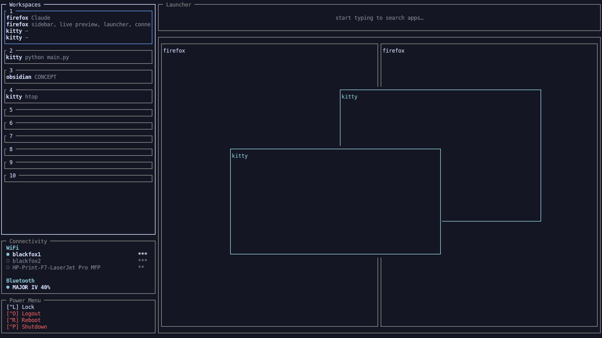

# tuicc

A minimal, function-oriented TUI control center for tiling window managers.

One key summons it, and you operate the whole system from one place —
sidebar with your workspaces, live preview of what's on screen, an
app launcher, wifi/bluetooth connectivity, and a power menu.

Built on a small core that only translates window-manager state into a
generic model, with everything else as swappable modules.

This is an early project of mine — the beauty is that it's fairly simple to run on any WM, as long as you're able to write your own WM provider: the only part of the code that talks directly to your WM and translates it into tuicc's data.



## Status: early / experimental

This is a from-scratch rebuild, actively in progress. Right now it can:

- Read live window/workspace state from **sway** and **i3** via the `sway.py` and `i3.py` providers (expandable to any WM, I hope!), including floating windows alongside tiled ones
- Render a workspace sidebar and a live preview of the focused workspace's windows, with proper Unicode box-drawing and a configurable color theme
- Tab through workspaces in the sidebar — the preview follows your selection, independent of the WM's own focus
- Arrow-key navigate into the preview and between individual windows (tiled and floating), then Enter to actually focus that window or switch to that workspace, exiting tuicc
- Fuzzy-search and launch apps from a horizontal launcher strip, spawned onto whichever workspace the sidebar currently has selected — not by switching focus first, but by spawning normally and moving the new window once it appears
- Show wifi and bluetooth status (known networks only — connecting to a new network needs a passphrase flow that isn't built yet) and toggle connections
- A power menu (lock, logout, reboot, shutdown, all user-defined) as a simple keyboard-navigable list, each entry with an optional confirm prompt and an optional keyboard shortcut
- Global keyboard shortcuts — bind a key like `Ctrl+L` to any power-menu action, and it fires from anywhere in the running app, not just when that entry happens to be selected
- Load layout, navigation, provider, and theme settings from a TOML config, with transparent, human-editable presets (no hidden defaults in code) — colors accept named values, hex, or [R,G,B], approximated to the nearest of curses's 256-color palette
- Both providers are covered by a small fixture-based test suite (`tests/`), recorded from real sway and i3 sessions, so provider changes can be checked without a running WM — 124 tests total, covering everything from provider parsing to layout math to config validation

Not yet built: scrollable-WM support (`scroll`/niri, see below), a
`quick_actions` module exists in the code but isn't wired into the
default layout yet (reserved for something more open-ended later). See
"Summoning tuicc" below for how to wire up a keybind on sway/i3,
Hyprland, or niri, and the architecture section below for where this
is headed.

## Try it

```bash
git clone https://github.com/Lshika-linux/tuicc
cd tuicc
python -m venv .venv
source .venv/bin/activate
pip install -r requirements.txt
python main.py
```

## Quick install

Want it set up as your daily driver (scratchpad summon, keybind, the
works) instead of a one-off look?

```bash
curl -fsSL https://raw.githubusercontent.com/Lshika-linux/tuicc/main/install.sh | bash
```

Clones tuicc into `~/.local/share/tuicc`, sets up a venv, detects sway
vs i3 (asks if it can't tell), seeds `~/.config/tuicc/config.toml`
with `provider`/`self_app_id` already set for a race-free scratchpad
summon (see "Summoning tuicc" below), installs a filled-in toggle
script to `~/.local/bin/tuicc_toggle.py`, and prompts for a keybind
(default `$mod+Tab`) — but never edits your WM config itself: it
prints the exact block to paste in and reload yourself. Re-run it any
time to update (`git pull`s the existing checkout instead of
re-cloning, and never overwrites an existing `config.toml`).

Prefer to see exactly what it does first, or don't want to pipe a
script straight into bash? `curl -fsSL <url above> -o install.sh`,
read it, then `bash install.sh`.

Tab/Shift+Tab move to the next/previous item, rolling into the
next/previous module once you run past either end of the current one
(Down/Up are plain duplicates of Tab/Shift+Tab). Left/Right jump
straight to the next/previous module's first item instead of stepping
through the rest of the current one. With `vim_mode = true`, h/j/k/l
duplicate left/down/up/right the same way (off by default — otherwise
those 4 letters would stop reaching the launcher's "type anywhere" search
for everyone, not just vim users). Enter runs the
selected item — switches to a workspace, focuses a window,
connects/disconnects wifi or bluetooth, runs a launcher/power-menu
entry, or (for destructive power actions) asks for confirmation first
— and **dismisses** tuicc (hides its window, doesn't end the process),
except for the launcher and connectivity, which stay open so you keep
working. Escape does the same at the top level (no menu/mode open) —
same as any other dismiss. Typing anywhere opens the launcher.

tuicc is meant to run as one long-lived process your WM shows and
hides, not something you relaunch each time — see "Summoning tuicc"
below. Config changes apply after a restart: summon, `Ctrl+C`,
relaunch — that's the only way to actually end the process; there's
deliberately no quit menu entry or quit keybind. Requires a running
sway or i3 session; set `provider = "sway"` or `provider = "i3"` under
`[wm]` in your config (see below). On i3, also check the power menu's
Lock/Logout commands — the packaged defaults are `swaylock`/`swaymsg
exit`, which `install.sh` swaps for `i3lock`/`i3-msg exit`
automatically; a plain git-clone setup needs that edited by hand (see
the comment above `[[power_menu.action]]` in `config.toml`).

## Testing

```bash
nix-shell -p 'python3.withPackages (ps: [ps.pytest ps.i3ipc ps.jeepney])' --run 'PYTHONPATH=src pytest tests/ -v'
```

No live WM connection needed — providers are tested against recorded
JSON fixtures (`tests/fixtures/`), and everything else pure-function
logic (layout math, config validation, keybind resolution, and so on)
is tested directly. Modules' actual `draw()` functions and `main.py`'s
event loop aren't covered (yet?) — both need a real curses screen to
test meaningfully.

## Configuration

tuicc reads from `~/.config/tuicc/config.toml`, created automatically
(copied from a packaged default) the first time you run it — so
there's always a real, editable file, never a hidden in-code default.

Layout presets work the same way, but per-preset-number:
`~/.config/tuicc/presets/<N>.toml` is where the preset you're actually
using lives, copied there from a built-in template
(`src/tuicc/presets/<N>.toml`) the first time that number is
requested, and never touched again after that unless you edit it
yourself. `[layout] preset = N` in `config.toml` picks which number to
use, and stays live-switchable — change the number any time, and
tuicc loads (or seeds, if it's new to you) that preset's file instead.

A preset is a list of boxes, each a plain x/y/w/h ratio (0.0-1.0) of
the terminal's width/height — see the comment header in any
`presets/*.toml` file for the full field reference, and the wiki's
[Config Reference](https://github.com/Lshika-linux/tuicc/wiki/Config-Reference)
page for more detail (may be out of date pending an update — the
old right_of/below/above/fill_to/cols/rows system was removed).
Boxes never coordinate with each other — resizing or repositioning
one never moves or resizes another; what you configure is exactly
what renders, always, by design. If a box looks wrong on a very
different terminal size than the one you set it up on, fix it with
tuicc's own interactive resize mode (`F2` on the module you want to
adjust; `F1` opens a help menu covering this and the rest of the
keybinds from inside tuicc itself) rather than hand-computing ratios.

`[[power_menu.action]]` and `[[quick_actions.action]]` currently take
identical fields (`label`, `command`, `confirm`, `shell_true`) — not
an accident left unfixed, but deliberate: they're kept in separate
namespaces because they're expected to diverge (power_menu is a fixed
system-action set; quick_actions is reserved for something more
open-ended later), and coupling them just because they *happen* to
look the same today would make that divergence harder, not easier.
Power-menu entries can also set `confirm_text` (a custom confirmation
question) and `shortcut` (a key like `"Ctrl+L"` — both binds it
globally and shows it in the entry's label automatically). `shell_true`
(default `false`) runs `command` as plain arguments, no shell
involved — set it to `true` only if the command needs real shell
syntax (pipes, `;`, `&&`, `$VARS`).

`[theme]` lives in `config.toml` like everything else here — nothing
about color resolution is packaged or hidden separately. (And yeah,
`config.toml` is a beefy boi by the time all the sections are in
there — that's the tradeoff for zero hidden defaults.)

## Summoning tuicc

tuicc is meant to run as a single, long-lived process, toggled into and
out of view by your WM — not relaunched each time. Launch it once (by
hand, or from your WM's startup config), then bind a key that shows/
hides its window; dismissing (Enter on most actions, or Escape at the
top level) hides it instantly with a warm process and warm caches,
ready for the next summon. The only way to actually end the process is
`Ctrl+C`.

`install.sh` (see "Quick install" above) sets most of this up for you
— clones, creates a venv, seeds `config.toml` with `self_app_id`
already set, drops a filled-in toggle script into `~/.local/bin/`, and
prints the exact block below for your WM so you can paste it in
yourself (it never edits your WM config for you). Everything below
also works by hand if you'd rather skip the installer.

Pick the one path below that matches your WM — each launches tuicc's
window carrying a recognizable identity (`tuicc_scratch`) so the WM
config can target it specifically, and so setting `[wm] self_app_id =
"tuicc_scratch"` in tuicc's own config.toml lets it mark (and later
dismiss) its own window unambiguously, no focus-timing assumptions
needed (see `CLAUDE.md` if you're curious why that matters).

**sway (and `scroll`) — scratchpad, single-keybind toggle:**

[`contrib/sway/tuicc_toggle.py`](contrib/sway/tuicc_toggle.py) picks
the right action based on tuicc's current state — launches it if it
isn't running, dismisses it if it's focused, brings it to focus
otherwise (un-hiding it from the scratchpad, or just switching to it)
— one keybind instead of juggling separate launch/show/hide binds.
Edit `APP_ID`/`TUICC_MAIN` at the top to match your setup, `chmod +x`
it, then:

```
# ~/.config/sway/config
for_window [app_id="tuicc_scratch"] floating enable
bindsym $mod+Tab exec ~/scripts_sway/tuicc_toggle.py
```

Don't add a static `for_window ... move scratchpad` rule alongside
this — the script does the scratchpad move/show itself, and a static
rule would hide tuicc the instant it maps, before the script's first
launch ever gets to show it.

If you'd rather not use the toggle script, a plain three-line summon
still works, just with separate implicit show/hide instead of one
smart toggle:

```
# ~/.config/sway/config
exec kitty --app-id tuicc_scratch -e python /path/to/tuicc/main.py
for_window [app_id="tuicc_scratch"] move scratchpad
bindsym $mod+Tab [app_id="tuicc_scratch"] scratchpad show
```

**i3 — scratchpad, single-keybind toggle:** the same idea, via
[`contrib/i3/tuicc_toggle.py`](contrib/i3/tuicc_toggle.py) — i3's
criteria use `class`, not `app_id` (i3 is X11-only, and kitty's
`--app-id` flag sets the X11 `WM_CLASS` class from the same
invocation):

```
# ~/.config/i3/config
for_window [class="tuicc_scratch"] floating enable
bindsym $mod+Tab exec --no-startup-id ~/scripts_i3/tuicc_toggle.py
```

Or, without the toggle script:

```
# ~/.config/i3/config
exec --no-startup-id kitty --app-id tuicc_scratch -e python /path/to/tuicc/main.py
for_window [class="tuicc_scratch"] move scratchpad
bindsym $mod+Tab [class="tuicc_scratch"] scratchpad show
```

**Hyprland — special workspace:**

```
# ~/.config/hypr/hyprland.conf
exec-once = kitty --app-id tuicc_scratch -e python /path/to/tuicc/main.py
windowrulev2 = workspace special:tuicc silent, class:^(tuicc_scratch)$
bind = $mainMod, Tab, togglespecialworkspace, tuicc
```

**niri — dedicated workspace** (niri has no scratchpad-equivalent, so
there's no built-in toggle — set `[wm] return_to_origin = true` in
tuicc's own config so Escape returns you to whatever workspace you
summoned from):

```
// ~/.config/niri/config.kdl
workspace "tuicc"
spawn-at-startup "python" "/path/to/tuicc/main.py"

binds {
    Mod+Tab { focus-workspace "tuicc"; }
}
```

All four still need a working `provider = "sway"` / `provider = "i3"`
under `[wm]` in tuicc's own config, matching whichever IPC your
compositor speaks — Hyprland/niri need their own provider (not built
yet, see the architecture section below) to report live state; the
WM-side toggle keybinds above document the summon shape ahead of that
provider landing.

`$mod+Tab` above is just this doc's example default (and what
`install.sh` proposes if you accept its default) — it can collide with
a window-switcher bind on some setups, so treat it as a starting point
to rebind, not a fixed convention.

## Architecture

The core does three things, and only three things:

- **WM provider layer** — translates window-manager state (sway, i3,
  and later others) into a generic model (`Window`, `Region`,
  `WMState`), so nothing else in the codebase needs to know which WM
  you're running. Providers also expose actions back to the WM
  (switching workspace, focusing a window, moving a window to a
  region) through the same contract, so `main.py` never hardcodes a
  WM-specific command.
- **Layout engine** — converts a layout (plain x/y/w/h ratios) into
  absolute terminal cells for each module. This gives you the freedom
  to run it fullscreen, as I do, or however you like; if a preset
  looks off on a very different terminal size, interactive resize
  mode fixes it in a few keypresses rather than needing a ratio that
  works everywhere out of the box.
- **Input routing** — tab order, global keyboard shortcuts, and
  hotkeys, all operating on a generic `NavItem` list, independent of
  which module an item belongs to. Movement is Tab-order cycling only
  (next/previous item, rolling into the next/previous module at either
  end) — an earlier version also had spatial arrow-key search across
  the whole layout, dropped for being unpredictable in practice and for
  needing real special-casing to work around overlapping floating
  windows in the preview. Tab-order cycling never does geometric
  search, so on-screen overlap isn't a problem it has to work around.

Modules — the sidebar, the preview, the launcher, connectivity, the
power menu, and future ones — live as standalone files under
`modules/`, each owning both how it draws itself and where its own
focusable items are. The core never guesses a module's internal
layout, and never hardcodes a module's name — adding one means adding
a line to `render.py`'s registries, not touching the render loop
itself. Modules can talk to each other only indirectly, through values
`main.py` computes and passes to all of them — e.g. selecting a
workspace in the sidebar tells the preview what to show, without
either module knowing the other exists.

Colors are resolved from config into curses color pairs at startup
(`theme.py` for the pure resolution logic, `theme_setup.py` for the
one-time curses setup) and passed down to every module the same way —
a module that doesn't care about a given role just ignores it.

Floating windows aren't drawn to mirror reality exactly (they can
overlap arbitrarily, and neither sway nor i3 exposes true stacking
order) — the goal is a readable overview of everything that's open, so
tiled windows draw first and floating windows draw on top, always, in
a distinct accent color with a filled background.

Config and presets are plain, transparent TOML — what you see is what
you get, no hidden defaults baked into Python. If you delete your
config or a preset file, tuicc regenerates a fresh default one :D

## Project structure

```
src/tuicc/
├── model.py                  # Window, Region, WMState — the generic WM model
├── layout.py                 # ModuleBox, Layout — module positions/sizes,
│                              #   as ratios, fixed counts, or box references
├── layout_engine.py          # resolves a Layout into absolute terminal cells
├── navigation.py              # NavItem, tab-order/hotkey navigation
├── keybinds.py                 # config key names -> curses key codes
├── actions.py                   # region/window focus handlers shared across modules
├── context.py                    # RenderContext — everything a module needs per frame
├── theme.py                       # resolves config colors (named/hex/RGB) to curses color numbers
├── theme_setup.py                  # one-time curses color pair setup at startup
├── config.py                        # loads + merges packaged defaults, presets, user config
├── render.py                         # module registry (draw + nav_items + action handlers)
├── render_utils.py                    # shared curses drawing helpers
├── resize_mode.py                      # interactive resize/move — ResizeState, SpawnPickerState
├── help_mode.py                        # F1 help menu — FAQ/keybinds, resize reference, color editor
├── defaults/config.toml                  # packaged default config
├── presets/                               # built-in layout presets (plain TOML) — copied to
│                                          #   ~/.config/tuicc/presets/<N>.toml on first use
├── modules/
│   ├── sidebar.py                # workspace list, reports nav items
│   ├── sidebar_compact.py        # compact workspace picker, no window listing
│   ├── preview.py                 # windows of the currently focused workspace
│   ├── launcher.py                 # fuzzy app search + launch
│   ├── connectivity.py              # wifi/bluetooth status + toggle
│   ├── power_menu.py                 # lock/logout/reboot/shutdown, user-defined
│   ├── sessions.py                    # save/load/delete a named set of window positions
│   ├── quick_actions.py                # generic action list — not in the default layout yet
│   └── clock.py                         # not in the default layout yet
└── providers/
    ├── base.py                # Provider contract every WM provider implements
    ├── registry.py             # provider name -> Provider class
    ├── sway.py                  # sway implementation
    └── i3.py                     # i3 implementation

src/tuicc/connectivity/
├── base.py                # WifiBackend/BluetoothBackend contracts
├── registry.py             # backend name -> backend class
├── iwd.py                   # wifi via iwd, over D-Bus (not iwctl text parsing)
├── bluez.py                  # bluetooth via bluetoothctl
├── worker.py                   # background thread — connect/disconnect never blocks the render loop
├── model.py                     # WifiNetwork/BluetoothDevice — the generic connectivity model
└── util.py                       # shared helpers (e.g. stripping ANSI codes from CLI output)
```

## Writing your own WM provider

tuicc doesn't know what sway, i3, or anything else is — it only knows
the `Provider` contract in `src/tuicc/providers/base.py`. If your WM
can implement this contract, tuicc can run on it, no changes needed
anywhere else in the codebase.

A provider must implement four methods:

```python
class Provider(ABC):
    def get_state(self) -> WMState:
        """Return the current window-manager state."""

    def focus_region(self, region_id: str) -> None:
        """Switch the WM's focus to the given region (e.g. workspace)."""

    def focus_window(self, window_id: str) -> None:
        """Switch the WM's focus to the given window."""

    def move_window_to_region(self, window_id: str, region_id: str) -> None:
        """Move the given window to the given region, without changing
        which region is currently visible."""
```

`WMState` (defined in `model.py`) is the generic shape every provider
translates into: a list of `Region`s (workspaces, or whatever your WM
calls them), each holding a list of `Window`s, with positions
normalized to 0..1 relative to their region — not pixels, so tuicc
never needs to know your screen resolution. `Window.floating` marks
windows that don't participate in a tiled layout.

`src/tuicc/providers/sway.py` and `src/tuicc/providers/i3.py` are the
reference implementations — both are short and worth reading end to
end before writing your own. Both use the `i3ipc` library to read the
WM's window tree and translate it into `WMState`, and send IPC
commands back to the WM for the focus/move methods. They're
deliberately kept close in structure so you can diff them to see
exactly what changes between a Wayland/wlroots WM and an X11 one:
i3 has no `app_id` (falls back to `window_class`), wraps floating
windows in a `floating_con` container that sway flattens away, and
i3's `workspace.leaves()` includes floating windows too, so the i3
provider has to de-duplicate them against `floating_nodes` explicitly.
If you're targeting a wlroots-based WM (sway, or a sway fork like
`scroll`), start from `sway.py`; if you're targeting anything else
speaking i3's IPC protocol (i3 itself, or another i3-compatible
fork), start from `i3.py`.

Once your provider class exists, register it in
`src/tuicc/providers/registry.py`:

```python
PROVIDERS = {
    "sway": SwayProvider,
    "i3": I3Provider,
    "yourwm": YourWMProvider,  # add this line
}
```

Users select it with `provider = "yourwm"` under `[wm]` in their
config. That's the whole integration surface — nothing in `main.py`,
`render.py`, or any module needs to change, verified by grepping the
whole codebase for stray sway/i3 references outside `providers/` and
`tests/`. If you find that isn't actually true for something you're
building, please open an issue — that separation is the core idea
this whole project stands on.

If your WM's window layout doesn't map cleanly onto sway's model
(e.g. scrolling/infinite layouts), the `rect` normalization is the
part to think hardest about — see the `Window.rect` docstring in
`model.py` for the constraints it needs to satisfy. Open an issue or
a draft PR if you get stuck; I'd genuinely like to see this work on
more than just sway and i3.

**Note:** what a `scroll`/niri provider would need is on my backlog,
coming soon (I hope)! — `scroll` (a sway fork with a PaperWM-style
scrolling layout) turns out to speak a superset of sway's IPC, plus a
`fully_visible` flag per window that's a natural fit for a
filmstrip-style preview (previous/current/next column) instead of
trying to render an entire infinite strip. Nothing built yet, but the
shape of the problem is clearer than it was.

## Why

Oh lord, that's the big question.

Because I don't rice, I use. I rice a little, just a pinch of rice, but primarily I use. I want a functioning, no-bullshit, no-bells-and-whistles space, and I hope to build that. If you vibe with that, you're in the right place. (Colors and styling will of course be customizable — I'm still trying to make it look appealing, don't worry.)

Existing tiling WM status bars and launchers tend to be single-purpose
and WM-specific. tuicc aims for one keybind, one place, that adapts to
whichever tiling WM (or scrolling WM) you're actually running.

## License

GPLv3 — see [LICENSE](LICENSE) for the full text. In short: you're free to
use, modify, and distribute tuicc, including commercially, but if you
distribute a modified version, it must stay open source under the same
license. So that everybody gets a better tuicc :)

## Professional tip for my elite readers who got all the way down here

If you run it in (SHOUTOUT!) [cool-retro-term](https://github.com/Swordfish90/cool-retro-term),
it looks sick af. Try it, really — just launch it with
`TERM=xterm-256color python main.py`, or curses will complain about
missing 256-color support, since cool-retro-term doesn't report
itself as 256-color-capable by default.

Have a blessed day <3
